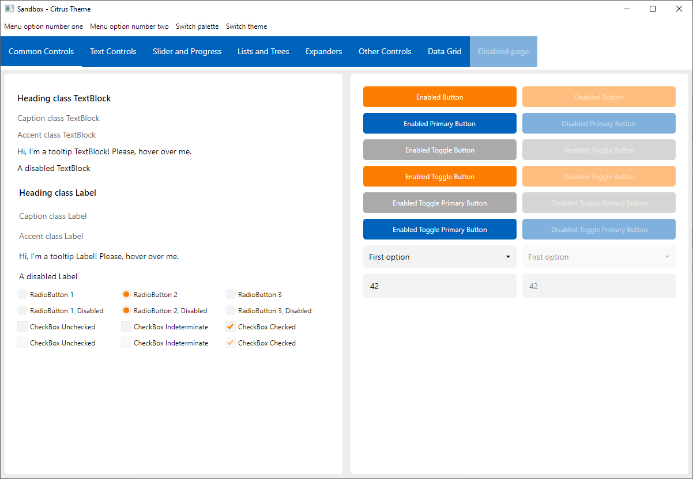
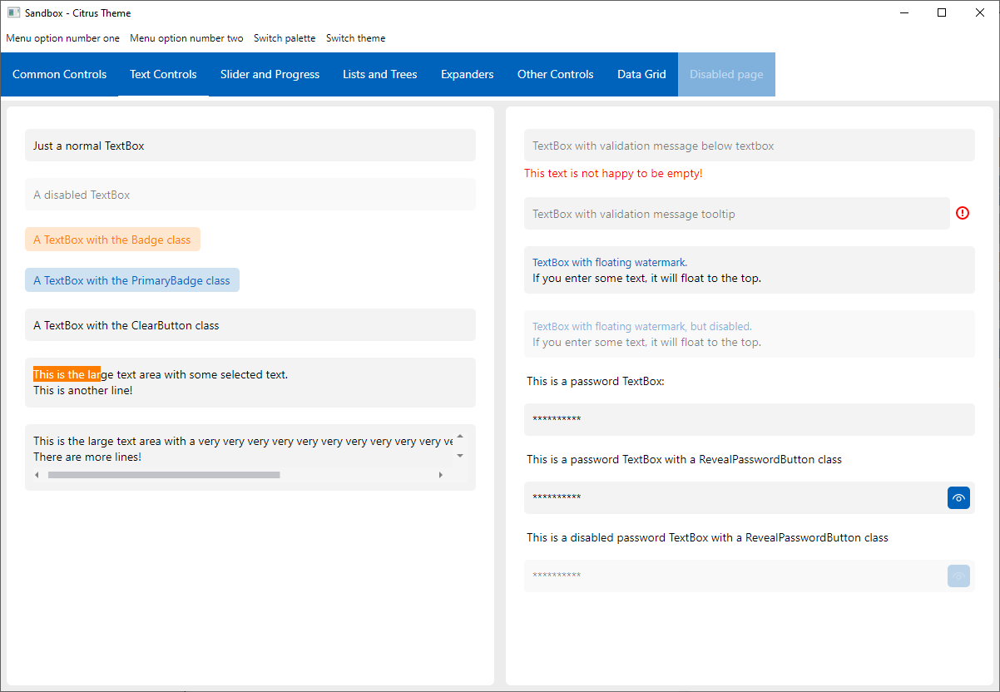
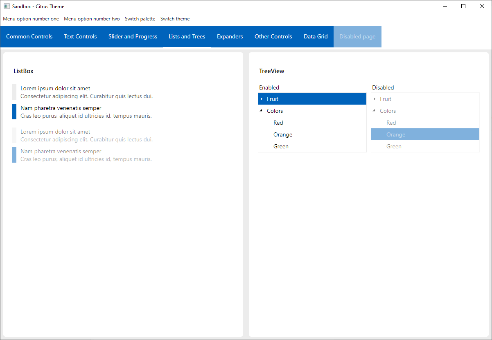
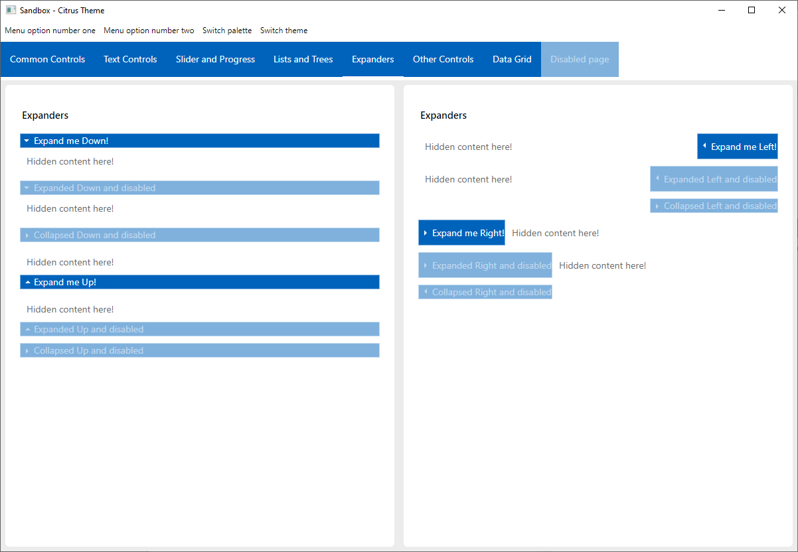
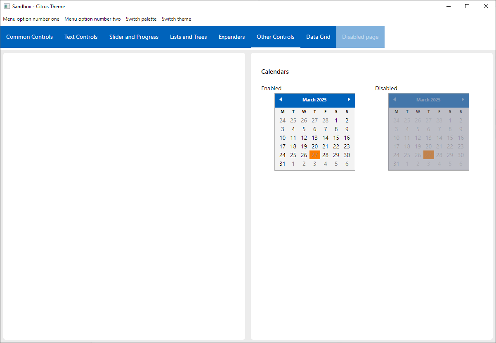
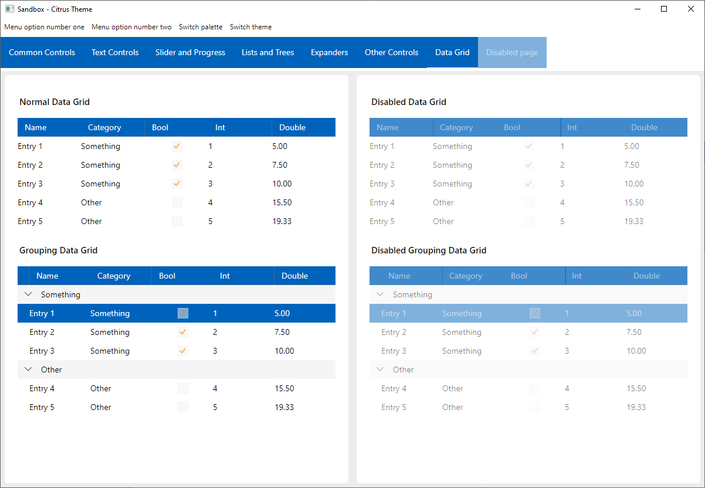

### Citrus Unofficial

An Avalonia experimental theme, originally developed by Artyom V. Gorchakov.

This is a heavily modified fork for my own custom use.

It was completely reworked to use Avalonia's new ControlTheme system instead of just plain old styles.

Since I am developing it to use it in my Martridge project, I also added some missing controls like the DataGrid which I needed there. I may further add other missing controls later on...

### Getting Started

Since this is not the official distribution, the NuGet package is not available.

If you want to use this theme, the way to do it is to add this repo as a [submodule](https://git-scm.com/book/en/v2/Git-Tools-Submodules) to your existing git repository:

```sh
git submodule add https://github.com/drone1400/Citrus.Avalonia ./citrus
# Reference the /citrus/src/Citrus.Avalonia/Citrus.Avalonia.csproj project.
# Reference the /citrus/src/Citrus.Avalonia.DataGrid/Citrus.Avalonia.DataGrid.csproj project if you need to use the DataGrid control.
# The /citrus/src/Citrus.Avalonia.Sandbox/Citrus.Avalonia.Sandbox.csproj is 
# the sandbox where you can browse the markup samples.
```

#### Simple way to use the theme

```xml
<Application x:Class="Citrus.Avalonia.Sandbox.App"
             xmlns="https://github.com/avaloniaui"
             xmlns:x="http://schemas.microsoft.com/winfx/2006/xaml"
             RequestedThemeVariant="Default">
    <Application.Styles>
        <Styles>
            <StyleInclude Source="avares://Citrus.Avalonia/CitrusTheme.xaml" />
        </Styles>
    </Application.Styles>
</Application>

```

### Theme Variants

Now implements ThemeVariants! The default Light theme is Citrus, the default Dark theme is Sea, and the Default fallback is also Citrus.

This means you can use `RequestedThemeVariant="Default"` in your application and Citrus will use the  Light or Dark variant automagically.

### Overriding implicit ThemeVariant values

You can customize what Light, Dark or even Default variants are used through the `CitrusTheme` style's properties: `DesiredLightThemeVariant`, `DesiredDarkThemeVariant` or `DesiredDefaultThemeVariant`. 

**NOTE:** the `IThemeVariantProvider` object use must not be included in another ThemeDictionary elsewhere, or you will get an exception: `System.InvalidOperationException: The ResourceDictionary already has a parent.`

#### Example implementation (xaml only)

```xml
<Application x:Class="Citrus.Avalonia.Sandbox.App"
             xmlns="https://github.com/avaloniaui"
             xmlns:x="http://schemas.microsoft.com/winfx/2006/xaml"
             xmlns:avalonia="clr-namespace:Citrus.Avalonia;assembly=Citrus.Avalonia"
             RequestedThemeVariant="Default">
    <Application.Styles>
        <Styles>
            <avalonia:CitrusTheme>
                <!-- Uncomment this to override light theme -->
                <!-- <avalonia:CitrusTheme.DesiredLightThemeVariant> -->
                <!--     <ResourceInclude Source="avares://Citrus.Avalonia/Palette/CandyPalette.xaml"/> -->
                <!-- </avalonia:CitrusTheme.DesiredLightThemeVariant> -->
                <avalonia:CitrusTheme.DesiredDarkThemeVariant>
                    <ResourceInclude Source="avares://Citrus.Avalonia/Palette/RustPalette.xaml"/>
                </avalonia:CitrusTheme.DesiredDarkThemeVariant>
            </avalonia:CitrusTheme>
        </Styles>
    </Application.Styles>
</Application>
```

#### Example implementation from codebehind

```xml
<Application x:Class="Citrus.Avalonia.Sandbox.App"
             xmlns="https://github.com/avaloniaui"
             xmlns:x="http://schemas.microsoft.com/winfx/2006/xaml"
             RequestedThemeVariant="Default">
</Application>
```
```cs
CitrusTheme citrusTheme = new CitrusTheme();
Uri uri = new Uri("avares://Citrus.Avalonia/Palette/RustPalette.xaml");
citrusTheme.DesiredDarkThemeVariant = new ResourceInclude(uri) { Source = uri };
Application.Current.Styles.Add(citrusTheme);
```


### Using a custom ThemeVariant

Other than the `Default`, `Light`, `Dark` ThemeVariants, you can of course use a custom ThemeVariant. the `CitrusTheme` object has some helper properties to facilitate this. 

You can use the `RegisterThemeVariant` method to register a custom ThemeVariant with the `CitrusTheme` style object. This effectively adds the ThemeVariant to the `CitrusTheme` style object's ThemeDictionaries.

You can then use the `GetRegisteredThemeVariants` method to get a list of all the currently registered ThemeVariants. Afterward, set the Application's `RequestedThemeVariant` to one of the ThemeVariants from the list to use the custom ThemeVariant.

#### Example using the RegisterThemeVariant method

```cs
CitrusTheme citrusTheme = new CitrusTheme();
citrusTheme.RegisterThemeVariant(new CitrusThemeVariantData("CustomPalette", "avares://Citrus.Avalonia.Sandbox/Palette/CustomPalette.xaml"));
IList<ThemeVariant> list = citrusTheme.GetRegisteredThemeVariants();
Application.Current.Styles.Add(citrusTheme);
Application.Current.SetValue(Application.RequestedThemeVariantProperty, list[list.Count-1]);
```


#### Example overriding the Light ThemeVariant from AvaloniaResource
```cs
CitrusTheme citrusTheme = new CitrusTheme();
Uri uri = new Uri("avares://Citrus.Avalonia.Sandbox/Palette/CustomPalette.xaml");
_citrusTheme.DesiredLightThemeVariant = new ResourceInclude(uri) { Source = uri };
Application.Current.Styles.Add(citrusTheme);
```

#### Example overriding the Light ThemeVariant from local file
```cs
CitrusTheme citrusTheme = new CitrusTheme();
using FileStream fileStream = new FileStream("MyCustomThemeVariantResourceDictionary.axaml", FileMode.Open, FileAccess.Read); 
object obj = AvaloniaRuntimeXamlLoader.Load(fileStream);
if (obj is ResourceDictionary dictionary) {
    citrusTheme.DesiredLightThemeVariant = dictionary;
}
Application.Current.Styles.Add(citrusTheme);
```

For more examples check out the `Citrus.Avalonia.Sandbox` project!


### Technologies and Tools Used

- <a href="https://github.com/avaloniaui">AvaloniaUI</a> cross-platform XAML-based GUI framework
- <a href="https://docs.avaloniaui.net/docs/concepts/reactiveui/">Avalonia.ReactiveUI</a> for MVVM implementation in the sandbox project
- <a href="https://github.com/reactiveui/reactiveui.validation">ReactiveUI.Validation</a> for `INotifyDataErrorInfo` validations
- <a href="https://www.jetbrains.com/rider/">JetBrains Rider</a> cross-platform C# IDE

### Example pictures

|                         |                       |
|-------------------------|-----------------------|
|    |  |
|    |  |
|    |  |
|    |  |
