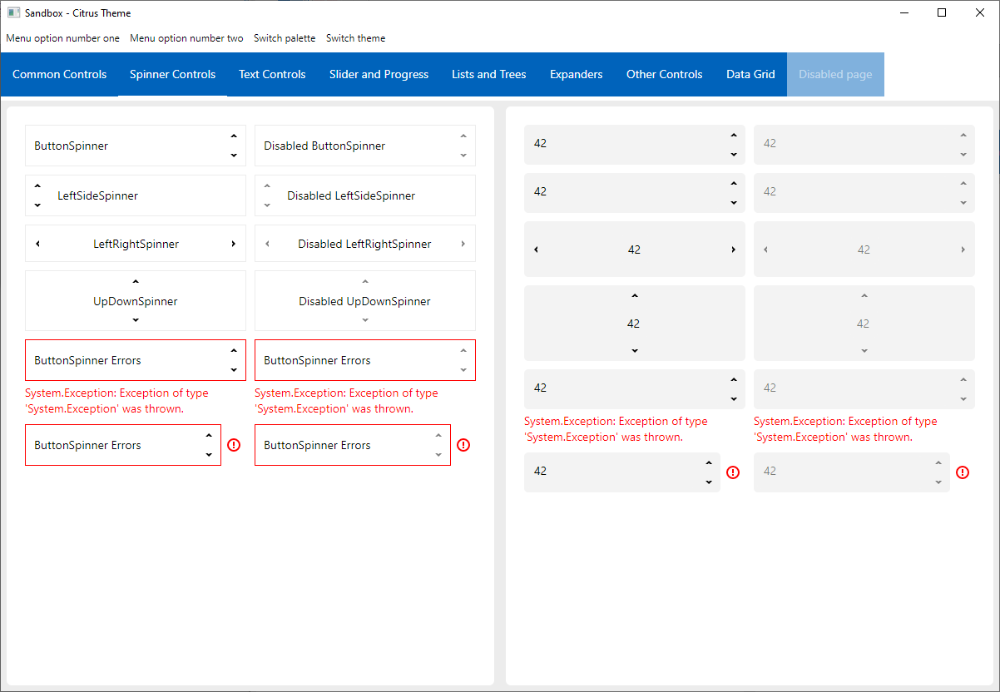
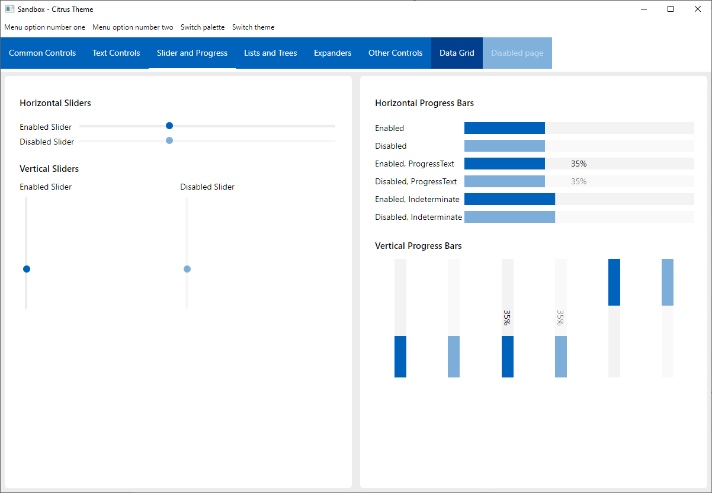

### Citrus Unofficial

An Avalonia experimental theme, originally developed by Artyom V. Gorchakov.

This is a heavily modified fork for my own custom use.

It was completely reworked to use Avalonia's new ControlTheme system instead of just plain old styles.

Since I am developing it to use it in my Martridge project, I also added some missing controls like the DataGrid which I needed there. I may further add other missing controls later on...

|                         |                       |
|-------------------------|-----------------------|
|    |  |
|    |  |
|    |  |
|    |                       |

### Known Issues / TODO
Urgent things to fix:
- ListBox text does not use the right Foreground color with dark themes
- DataGrid text does not use the right Foreground color with dark themes
- NumericUpDown seems broken...

### Getting Started

Since this is not the official distribution, the NuGet package is not available.

If you want to use this theme, the way to do it is to add this repo as a [submodule](https://git-scm.com/book/en/v2/Git-Tools-Submodules) to your existing git repository:

```sh
git submodule add https://github.com/drone1400/Citrus.Avalonia ./citrus
# Reference the /citrus/src/Citrus.Avalonia/Citrus.Avalonia.csproj project.
# Reference the /citrus/src/Citrus.Avalonia.DataGrid/Citrus.Avalonia.DataGrid.csproj project if you need to use the DataGrid control.
# The /citrus/src/Citrus.Avalonia.Sandbox/Citrus.Avalonia.Sandbox.csproj is 
# the sandbox where you can browse the markup samples.
```

### Technologies and Tools Used

- <a href="https://github.com/avaloniaui">AvaloniaUI</a> cross-platform XAML-based GUI framework
- <a href="https://docs.avaloniaui.net/docs/concepts/reactiveui/">Avalonia.ReactiveUI</a> for MVVM implementation in the sandbox project
- <a href="https://github.com/reactiveui/reactiveui.validation">ReactiveUI.Validation</a> for `INotifyDataErrorInfo` validations
- <a href="https://www.jetbrains.com/rider/">JetBrains Rider</a> cross-platform C# IDE
